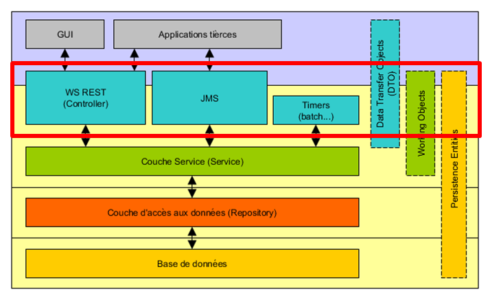

# **Formation Java Backend**

Les fondamentaux ( et un peu plus 🚀)

---
# Préambule

* Tour de table
* Objectifs de la formation

---

# Plan (1/2)  

- Conception générale
- Maven & Spring Boot
- Couche REST
- Couche service
- Test *unitaires*
- Outils de mapping
- Couche de persistence
- Transactions
- Validation des inputs
---

# Plan (2/2)

- Concurrence
- La sécurité
- Gestion des erreurs
- Les batchs
- JMS 
- JTA
- Appels WS REST
- Bonus
  - *Les logs / Swagger / AOP*
---
  
# Environnement de TP (1/2)

> JDK 11-17:  Installer une Open JDK via https://adoptium.net/

Installation dans le répertoire souhaité
Ajout de la variable d’environnement JAVA\_HOME pointant vers le répertoire d’installation du JDK
Ajout du path suivant à la variable d’environnement PATH : `%JAVA_HOME%\bin`

> Maven : https://maven.apache.org/download.cgi

Dézip dans le répertoire souhaité
Ajout de la variable d’environnement `MAVEN_HOME` pointant sur le répertoire maven
Ajout du path suivant à la variable d’environnement PATH : `%MAVEN_HOME%\bin`
Mise à jour / création du ficher `C:\Users\USER\.m2\settings.xml`

---
# Environnement de TP (2/2)

- Mon IDE préféré (Eclipse / Intellij / VSCode)
  - De préférence avec les plugins pour `Spring` & `MapStruct`
- `Lombok` sera nécessaire aussi https://projectlombok.org/
- Git 

--- 

# Introduction

Application permettant de créer une liste de tâches
- Afficher tous les Todos en cours
- Créer un Todo
- Modifier un Todo
- Clore un Todo
- Supprimer un Todo
- Supprimer l’intégralité des Todos
- Envoi d’un email à la suppression d’un Todo

---

# Conception générale - Modèle en couche

---

# Couche Persistance

## JPA - Java Persistence API

- Eclipse Link
- Open JPA
- Hibernate

<!-- 
- Premier levier d'interaction avec la base de donnée 
- Propose une abstraction en modelisation les tables comme des objects java 
- Puissant mais souvent mal utilisé (optimisation des requetes 
- D'autres alternatives existent (`JOOQ`) -->

---

# Couche Services

## Services

- Couche métier: logique applicative

## Timers / Orchestrateur

- Quartz
- Spring Scheduling

---

# Couche "Transfert"

## Interaction avec le reste du monde

* REST
  * JSR311 - Jersey/CXF
* SOAP
  * JSR224 - JAX-WS/CXF
* JMS (Java Message Service)
  * RabbitMQ
  * ActiveMQ

---

# Spring (1/2)

> Le ciment / lien entre toutes les couches

* Framework java le plus utilisé au monde
  * Alternative à un serveur d'application standard JEE
  * Conteneur `léger`
* Gère le cycle de vie des objects java (`Beans`)
* Gère l'injection de dépendances
* Propose une configuration Java ou XML

---

# Spring (2/2)

## Expérience dévelopeur découplée avec Spring Boot

Nombreux project / plugins sont disponibles
- Spring Cloud
- Spring Integration
- Spring Data
- Spring Batch
- Spring Security

