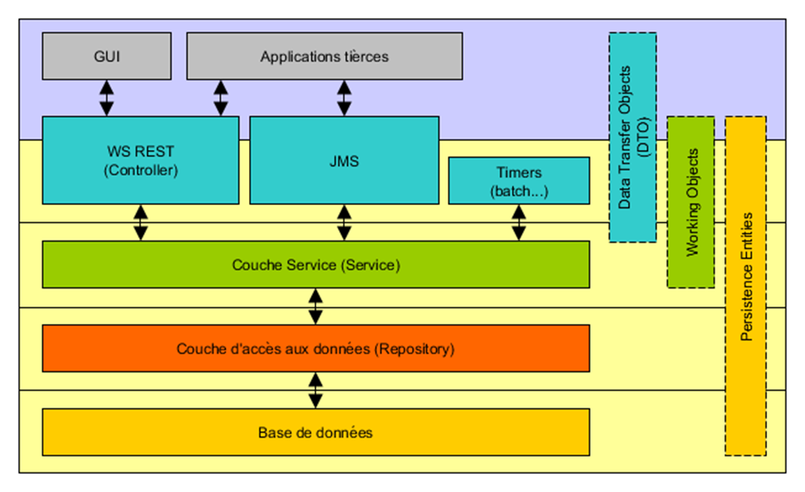
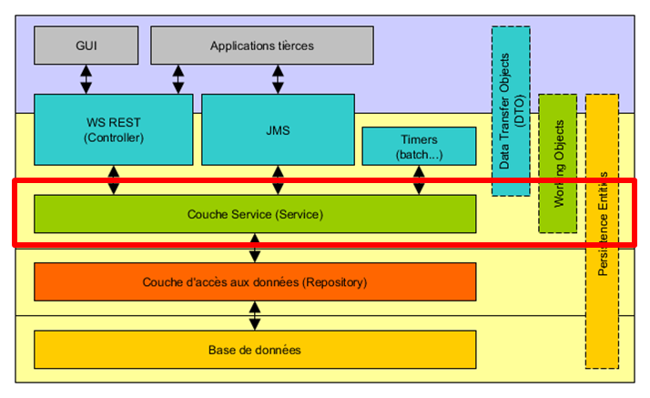
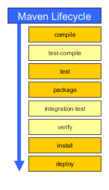

# **Formation Java Backend**

Les fondamentaux ( et un peu plus 🚀)

---

# Préambule

* Tour de table
* Objectifs de la formation

---

# Plan (1/2)

- Conception générale
- Maven & Spring Boot
- Couche REST
- Couche service
- Test *unitaires*
- Outils de mapping
- Couche de persistence
- Transactions
- Validation des inputs

---

# Plan (2/2)

- Concurrence
- La sécurité
- Gestion des erreurs
- Les batchs
- JMS
- JTA
- Appels WS REST
- Bonus
    - *Les logs / Swagger / AOP*

---

# Environnement de TP (1/2)

> JDK 11-17:  Installer une Open JDK via https://adoptium.net/

Installation dans le répertoire souhaité Ajout de la variable d’environnement JAVA\_HOME pointant
vers le répertoire d’installation du JDK Ajout du path suivant à la variable d’environnement
PATH : `%JAVA_HOME%\bin`

> Maven : https://maven.apache.org/download.cgi

Dézip dans le répertoire souhaité Ajout de la variable d’environnement `MAVEN_HOME` pointant sur le
répertoire maven Ajout du path suivant à la variable d’environnement PATH : `%MAVEN_HOME%\bin`
Mise à jour / création du ficher `C:\Users\USER\.m2\settings.xml`

---

# Environnement de TP (2/2)

- Mon IDE préféré (Eclipse / Intellij / VSCode)
    - De préférence avec les plugins pour `Spring` & `MapStruct`
- `Lombok` sera nécessaire aussi https://projectlombok.org/
- Git

--- 

# Introduction

Application permettant de créer une liste de tâches

- Afficher tous les Todos en cours
- Créer un Todo
- Modifier un Todo
- Clore un Todo
- Supprimer un Todo
- Supprimer l’intégralité des Todos
- Envoi d’un email à la suppression d’un Todo


---

# Conception générale - Modèle en couche



---

# Couche Persistance

## JPA - Java Persistence API

- Eclipse Link
- Open JPA
- Hibernate


<!-- 
- Premier levier d'interaction avec la base de donnée 
- Propose une abstraction en modelisation les tables comme des objects java 
- Puissant mais souvent mal utilisé (optimisation des requetes 
- D'autres alternatives existent (`JOOQ`) -->

---

# Couche Services

## Services

- Couche métier: logique applicative

## Timers / Orchestrateur

- Quartz
- Spring Scheduling



---

# Couche "Transfert"

## Interaction avec le reste du monde

* REST
    * JSR311 - Jersey/CXF
* SOAP
    * JSR224 - JAX-WS/CXF
* JMS (Java Message Service)
    * RabbitMQ
    * ActiveMQ


---

# Spring (1/2)

> Le ciment / lien entre toutes les couches

* Framework java le plus utilisé au monde
    * Alternative à un serveur d'application standard JEE
    * Conteneur `léger`
* Gère le cycle de vie des objects java (`Beans`)
* Gère l'injection de dépendances
* Propose une configuration Java ou XML


---

# Spring (2/2)

### Nombreux project / plugins sont disponibles

- Spring Boot
- Spring Cloud
- Spring Integration
- Spring Data
- Spring Batch
- Spring Security


---

# Maven

> Alternative: gradle

**Son objectif**

- Rendre le processus de build simple
- Uniformiser le processus de build et de release
- Gérer les dépendances du projet

> Commandes classiques:
> `mvn clean install`
> `mvn clean install -DskipTests`


---

# Maven - POM

```xml

<project xmlns="http://maven.apache.org/POM/4.0.0"
  xmlns:xsi="http://www.w3.org/2001/XMLSchema-instance"
  xsi:schemaLocation="http://maven.apache.org/POM/4.0.0 http://maven.apache.org/xsd/maven-4.0.0.xsd">
  <modelVersion>4.0.0</modelVersion>

  <!-- Définit généralement une organisation-->
  <groupId>com.thales.formation</groupId>
  <!-- Définit de manière unique un binaire -->
  <artifactId>formation-java</artifactId>
  <!-- Définit la version spécifique -->
  <version>0.0.1-SNAPSHOT</version>
  <!-- jar / war / ear / zip -->
  <packaging>jar</packaging>

  <parent>
    <!-- -->
  </parent>

  <properties>
    <!-- Des attributs du projet -->
  </properties>

  <dependencies>
    <!-- Les dependances du projet -->
  </dependencies>

  <build>
    <plugins>
      <!-- les plugins du projet -->
    </plugins>
  </build>
</project>
```

<!--
Le POM 'project object model' est une reprentation XML du projet et permet de définir:
- Le nom du projet
- La version
- La packaging de l'artefact
- Les attributs du projet
- Les dépendances
- Les plugins: qui sont des extensions de maven

Un point sur le packaging qui peut être:
- pom (pour déclarer uniquement des parties communes (dependances, plugins propriétés)
- jar (par défaut)
  - fonctionne souvent en standalone (_uber_ jar avec les dépendances voir, le serveur inclus)
  - souvent utilisé pour les microservices mais pas que
- war
  - packaging plutôt dédié aux serveurs d'application léger (tomcat)
  - Un seul serveur hébergeant plusieurs applications
- ear
  - packaging historique dédié aux serveurs d'application "Enterprise"
  - JEE / JBOSS
-->

---

# Maven - POM - Modules


Maven permet de définir une structure projet via les `modules`

```xml

<project xmlns="http://maven.apache.org/POM/4.0.0"
  xmlns:xsi="http://www.w3.org/2001/XMLSchema-instance"
  xsi:schemaLocation="http://maven.apache.org/POM/4.0.0 http://maven.apache.org/xsd/maven-4.0.0.xsd">
  <modelVersion>4.0.0</modelVersion>

  <groupId>com.thales.formation</groupId>
  <artifactId>formation-java</artifactId>
  <packaging>jar</packaging>

  <!-- ...  -->
  <modules>
    <module>module1</module>
    <module>module2</module>
  </modules>
</project>
```

<!-- 
Avantages d'utiliser les modules:
- Un seul commande pour tout builder
- Possibilité de builder uniquement un sous-modules
- Possiblité de mutaliser un certain nombre de paramétrage (plugin, dependencies, properties, etc..)
-->

---

# Maven - POM - Dépendances #1

- Définies via une `groupId`, `artifactId`, `version` minimum
    - _des fois on peut ajouter `classifier` ou `packaging`_
- Maven se charge de les récupérer
    - également les dépendances transitives ⚠️

```xml
  <dependencyManagement>
    <!-- Souvent utiliser pour mutaliser les dépendances -->
  </dependencyManagement>

  <dependencies>
    <dependency>
      <groupId>totoGroup</groupId>
      <artifactId>totoId</artifactId>
      <!-- La version est inutile si déjà décrite dans  "dependencyManagement"-->
      <version>1.2.0</version>
      <!-- Facultatif-->
      <scope></scope>
    </dependency>
  </dependencies>
```
---

# Maven - POM - Dépendances #2

- `compile` : Scope par défaut. Utilisé pour le build, test et run
- `provided` : build et test. Non embarqué dans le package car sera fournie au runtime
- `runtime` : test et run
- `test` : test
- `system` : Provided mais basé sur un chemin et non une dépendance externe (_e.g. jar local_)
- `import` : Dans le `dependencyManagement` uniquement. Permet d’importer le `dependencyManagement` d’un autre pom

---

# Maven - POM - Build #1

- Le build nous dit "comment" est construit le projet
  - Version de compilation java
  - Encoding des fichiers
  - Les étapes
  - Les plugins / extensions à configurer
    - _e.g. génération de code, fichier complémentaire à inclure, vérifications de format/code_
```xml
<build>
  <plugins>
    <plugin>
      <groupId>org.springframework.boot</groupId>
      <artifactId>spring-boot-maven-plugin</artifactId>
    </plugin>
  </plugins>
</build>
```

---

# Maven - POM - Build #2

* Maven dispose également de la notion de `profile`
  * Permet de customizer le build (_en fonction OS, variables env, autres_)

* SCM + Distribution Management
  * Concerne la « release » du projet
  * Déploie le projet dans un repository
  * Intégration avec un gestionnaire de version (ex : git, mercurial, svn…)

---
# Maven - Structure d'un projet

```bash
my-app/
├── pom.xml # Notre point d'entrée
├── src/main/java  # Le code source (qui ira en prod)
    ├── com/mycompagny/app
        ├── myjava.java
├── src/main/resources # D'autres resources embarqués (e.g. configuration, templates)
│   ├── app.properties
├── src/test/java # Le code source des tests uniquement
├── src/test/resources # resources spécifiques aux tests 
├── target/ # répertoire OUTPUT de maven 
```

---
# Maven - A retenir 📇

▌ **Uniformisation du build**
▌ **Configuration XML dans le pom.xml**
▌ **Simple car bien cadré mais difficile de s’écarter du chemin**
▌ **Jamais de dépendance « variable ». On précise la version dans sa totalité**